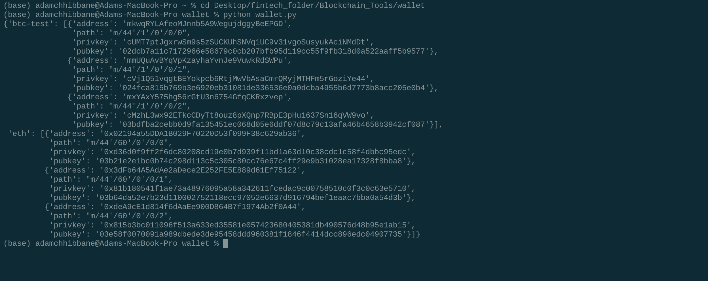
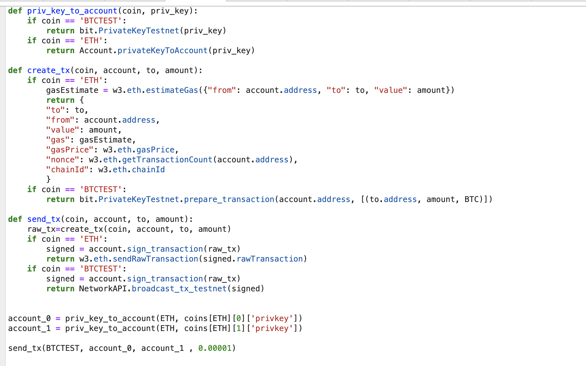
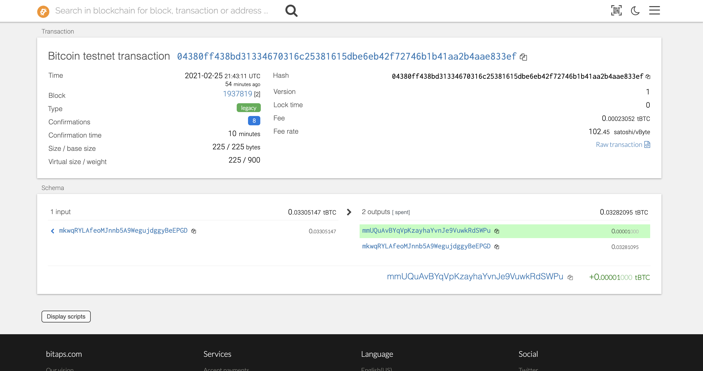
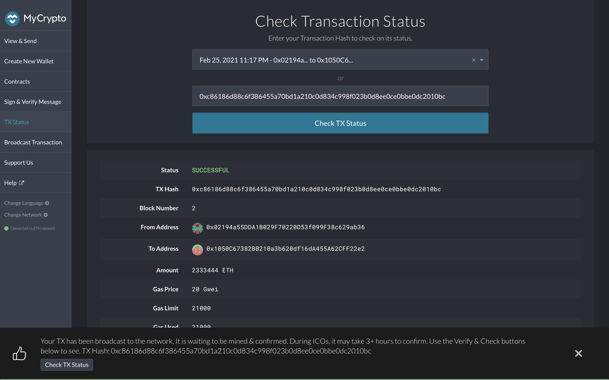
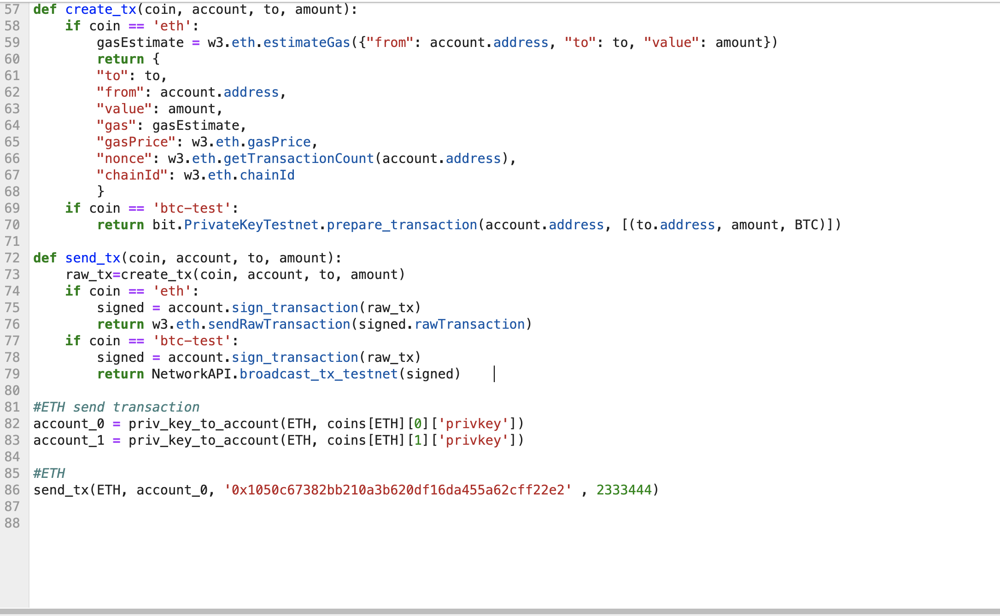

#### Blockchain and Python

### Description

We will be building a universal wallet using the `hd-wallet-derive` command tool to integrate with python script, allowing you to manage countless addresses and over 300+ coins! We will start by working with BTC and ETH to get the picture of how it works.

## Dependencies

- PHP must be installed on your operating system (any version, 5 or 7). Don't worry, you will *not* need to know any PHP.

- You will need to clone the [`hd-wallet-derive`](https://github.com/dan-da/hd-wallet-derive) tool.

- [`bit`](https://ofek.github.io/bit/) Python Bitcoin library.

- [`web3.py`](https://github.com/ethereum/web3.py) Python Ethereum library.

### Instructions

### Project setup

- Create a project directory called `wallet` and `cd` into it.

- Clone the `hd-wallet-derive` tool into this folder and install it using the instructions on its `README.md`.

- Create a symlink called `derive` for the `hd-wallet-derive/hd-wallet-derive.php` script into the top level project
  directory like so: `ln -s hd-wallet-derive/hd-wallet-derive.php derive`

  This will clean up the command needed to run the script in our code, as we can call `./derive`
  instead of `./hd-wallet-derive/hd-wallet-derive.php`.

- Test that you can run the `./derive` script properly, use one of the examples on the repo's `README.md`

- Create a file called `wallet.py` -- this will be your universal wallet script. You can use [this starter code](Starter-Code/wallet.py) as a starting point.

Your directory tree should look something like this:

### Setup constants

- In a separate file, `constants.py`, set the following constants:
  - `BTC = 'btc'`
  - `ETH = 'eth'`
  - `BTCTEST = 'btc-test'`

- In `wallet.py`, import all constants: `from constants import *`

- Use these anytime you reference these strings, both in function calls, and in setting object keys.

### Generate a Mnemonic

- Generate a new 12 word mnemonic using `hd-wallet-derive` or by using [this tool](https://iancoleman.io/bip39/).

- Set this mnemonic as an environment variable, and include the one you generated as a fallback using:
  `mnemonic = os.getenv('MNEMONIC', 'insert mnemonic here')`

### Deriving the wallet keys

- Use the `subprocess` library to call the `./derive` script from Python. Make sure to properly wait for the process.

- The following flags must be passed into the shell command as variables:
  - Mnemonic (`--mnemonic`) must be set from an environment variable, or default to a test mnemonic
  - Coin (`--coin`)
  - Numderive (`--numderive`) to set number of child keys generated

- Set the `--format=json` flag, then parse the output into a JSON object using `json.loads(output)`

- You should wrap all of this into one function, called `derive_wallets`

- Create an object called `coins` that derives `ETH` and `BTCTEST` wallets with this function.
  When done properly, the final object should look something like this (there are only 3 children each in this image):

You should now be able to select child accounts (and thus, private keys) by calling `coins[COINTYPE][INDEX]['privkey']`

### Sending Transactions

From the `wallet` folder, we will call the python script to now access the functions directly.

## BTCTEST

Having prefunded one of the addresses via a faucet of your choice, call the following to transact with BTCTEST between addresses [0] and [1]

Once you've sent the transaction, you can confirm using a block explorer (https://tbtc.bitaps.com/) to watch transactions on the address.

## ETH PoA

Sending Ethereum from one of the accounts to a third party address via MyCrypto

